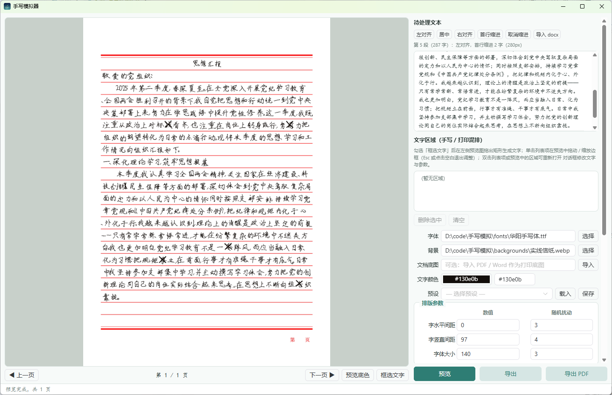
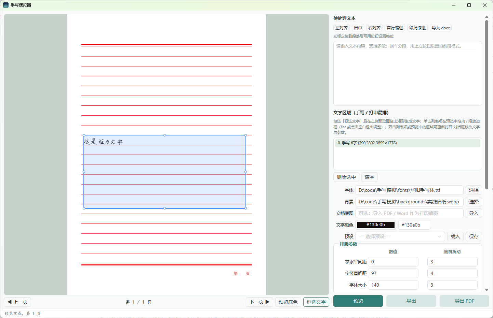

# handwrite-sim（手写模拟器 · Rust 版）

把普通文本变成以假乱真的手写体图片：选择一款手写字体、一张信纸背景，程序会按真实的书写习惯排版并施加**字距、行距、字号、笔画位移、笔画旋转**等多种随机扰动，让每个字、每一页都独一无二。

本项目是 [Handwriting-simulator](https://github.com/bamboostrip/Handwriting-simulator)（Python/PyQt6 版）的 **Rust 重写**，核心渲染引擎为纯 Rust 实现，目标：

- **性能**：核心渲染 10-30 倍提升（排版/扰动从 Python 解释器开销中解放）
- **兼容**：软件渲染兜底，无 GPU 老机器/虚拟机也能跑
- **跨平台**：Windows / macOS / Linux 三端均可构建运行

## 界面预览



右栏为参数面板（待处理文本与段落排版、文字区域、字体 / 背景 / 文档底图选择、文字颜色、预设切换、排版与扰动参数、写错字模拟），左侧为多页预览区，停止输入 300ms 后自动渲染。



预览图上拖拽画框即可创建文字区域，框内文字独立排版渲染；单击列表项或区域显示调整框，可整体拖动 / 8 向缩放二次微调，双击重新编辑。

## 与 Python 版的差异

| | Python 版 | Rust 版 |
| --- | --- | --- |
| 渲染引擎 | numpy + scipy（FastEngine） | 纯 Rust：ab_glyph + 自研笔画扰动引擎 |
| 界面 | PyQt6 | Tauri 2 + Vue 3（系统 WebView 渲染；Rust 命令层复用核心引擎） |
| PDF 导出 | ✅（同步对齐） | ✅ **300 DPI 位图层 PDF**（printpdf + lopdf） |
| 错字率模拟 | ✅（同步对齐） | ✅ **错字率 + 划掉重写**（单线/双线/斜线/叉号四种涂改样式） |
| 框选文字区域 / 文档底图 | ✅（同步对齐） | ✅（该功能由 Rust 版先行实现，Python 版已对齐） |
| docx 导入 | python-docx | zip + quick-xml 自研解析（对齐/首行缩进） |
| 预览降采样 | PIL resize | fast_image_resize（SIMD，32MP 背景毫秒级） |

> 两个版本功能保持同步（PDF 导出、错字率模拟 Python 版已对齐）。
> 由于 Rust 版性能优异，部分新功能可能由 Rust 版先行实现，随后同步到 Python 版。

## 技术栈

| 类别 | 选型 |
| --- | --- |
| 语言 | Rust（edition 2021，MSRV 1.92+）+ TypeScript |
| 桌面框架 | Tauri 2（系统 WebView：Windows WebView2 / macOS WKWebView / Linux WebKitGTK） |
| 前端 | Vue 3 + Vite + Naive UI + VueUse（仓库根目录，create-tauri-app 标准布局） |
| 命令层 | Tauri commands：参数校验、后台渲染调度、文件 IO（`src-tauri/`） |
| 渲染引擎 | ab_glyph（字体光栅化）+ 自研笔画扰动（连通域 + 旋转平移） |
| 图像处理 | image（PNG/webp/bmp 背景与导出） |
| 文件对话框 | tauri-plugin-dialog（系统原生对话框，前端经 `@tauri-apps/plugin-dialog` 调用） |
| docx 解析 | zip + quick-xml |
| PDF 导出 | printpdf + lopdf（300 DPI 位图层） |
| 随机扰动 | rand / rand_distr（正态分布） |
| 持久化 | serde / serde_json（预设 JSON v2，兼容 Python 版格式） |
| 测试 | cargo test（引擎/预设/docx/UI 映射） |

## 快速开始

```bash
# 安装依赖（Node 20+/22+，pnpm；根目录即 pnpm workspace）
pnpm install

# 开发模式（= Vite HMR + cargo run，官方标准入口）
pnpm tauri dev

# 运行全部测试（核心引擎）
cargo test --workspace

# 发布构建（vue-tsc + vite 构建前端并嵌入，LTO + strip）
pnpm tauri build --no-bundle
```

产物在 `target/release/handwrite-sim(.exe)`，exe 为便携模式：把 exe 放进任意目录，同目录下的
`presets/`、`backgrounds/`、`fonts/` 即为资源根目录，整个文件夹可随意拷贝移动。
Windows 本地一键打包：`pwsh scripts/package-win.ps1`。

## 功能特性

- **富文本输入**：多段文本、空行，所见即所得；回车分段、段首退格合并，自动滚入视野
- **段落排版工具**：左对齐 / 居中 / 右对齐 / 首行缩进（2 字符，按当前字号换算），支持整段应用
- **导入 docx**：自动解析段落对齐方式与首行缩进（沿样式链继承）
- **字体 / 背景选择**：字体支持 `.ttf` `.ttc` `.otf`；背景支持 `.png` `.jpg` `.jpeg` `.webp` `.bmp`
- **文字颜色**：`#RRGGBB` 十六进制颜色值
- **排版参数**：字水平间距、行距、字体大小，每个都带独立的随机扰动 σ
- **笔画扰动**：水平位移、竖直位移、笔画旋转三个独立扰动强度
- **边距设置**：上 / 下 / 左 / 右
- **边界提示（仅预览）**：开关 + 自定义颜色，直观看清实际渲染边界（默认关闭）
- **写错字模拟**：错字率 0~30%，随机错字划掉后在正上方小一号重写（或后文正常位置重写），
  涂改样式可选单线 / 双线 / 斜线 / 叉号
- **实时自动预览**：停止输入 300ms 后自动渲染，后台线程不卡界面；预览按比例降采样，导出始终全分辨率
- **多页预览**：上一页 / 下一页 / 页码指示，自动分页
- **框选文字区域**：预览图上拖拽画框，文字在框内独立排版渲染，支持手写体 / 打印体混排；
  单击列表项或直接在预览画布上单击区域即可唤出带有 8 个缩放手柄的调整框，支持平移与八向缩放二次微调，
  单击选框外侧任意图纸或留白处（或按 Esc 键）即可退出选框恢复纯净预览，双击区域重新打开编辑属性
- **区域编辑对话框**：内置富文本段落编辑器（逐段对齐 / 首行缩进、一键导入 docx 段落）；
  排版与扰动参数可逐区域覆盖（字距 / 行距 / 字号及 σ、笔画扰动、错字率与涂改样式、文字颜色、
  四向内边距），未设置项跟随主设置，打印体区域强制零扰动零错字；区域内容在所在页内排版，
  超出框选范围自然截断
- **导入 PDF / Word 文档底图与背景高亮自动识别（手写填空模式）**：
  在 Word/WPS 中用**背景高亮色**标记需要手写的内容，未标记题干原样保留为高清单页打印底图；导入时自动识别并无痕擦除高亮底色块，精准提取原文字号、行距、缩进与框选坐标；**强烈推荐先另存为 PDF 再导入**，像素级 100% 还原文档原始排版，彻底解决复杂表格、试卷格式错位问题
- **笔迹角色管理（多字体与多人笔迹混排）**：自动根据高亮颜色划分手写角色（如角色 1、角色 2），可为不同角色分配独立的手写字体文件、墨水颜色（黑色中性笔、蓝色圆珠笔、红笔批注）与书写扰动，实现两人共写或多重字迹风格混排
- **纯背景预览**：无需输入文字，选好背景（图片或导入文档）即可直接预览，方便先摆好版式再逐页框选
- **内置使用指南（使用教程）**：底部状态栏与「关于」弹窗集成直观图文教程，开箱即懂
- **预览底色切换**：浅灰绿 / 深灰两档
- **预设系统**：`presets/` 目录内预设下拉一键切换，也支持保存 / 载入任意位置（JSON v2，兼容 Python 版）
- **一键导出**：全部页面导出为 `0.png`、`1.png`…… 到所选目录
- **PDF 导出**：300 DPI 位图层 PDF（printpdf + lopdf），适合打印/存档

## 试卷 / 表格文档高亮手写填空教程

适合**实验报告、试卷答题、各类申请表/登记表**等既有固定打印题干、又需在空白处手写填空的场景。

### 1. 文档制作与高亮标记
1. 在 Word（或 WPS）中打开您的文档；
2. 保持题目、表格、题干等**无背景色**（系统会自动将其保留为打印体底图）；
3. 选中需要模拟手写填空的内容，使用 Word 的**「突出显示文本颜色（高亮）」**标记背景色（如黄色、绿色、青色等）。

### 2. 导出 PDF 并导入（推荐 ⭐）
- 在 Word 中点击「文件」→「另存为 PDF」或「导出为 PDF」；
- 打开本软件，点击面板中的**「导入文档底图」**，选择刚才导出的 PDF 文件；
- **为什么推荐 PDF？** Word 直接导入受系统本地字体环境与渲染引擎差异影响，极易发生边距或表格轻微移位；导出为 PDF 后版式完全固化，软件能 100% 像素级高清单页还原底图！

### 3. 智能自动识别
- 软件会自动将文档逐页渲染为高清底图，**自动擦除高亮背景色块**恢复干净纸面；
- 运用全角字符紧包围盒算法，智能校准原文字号与行距，在对应位置自动生成手写文字区域；
- 识别的不同高亮颜色会自动归类为「手写角色 1」、「手写角色 2」等。

### 4. 选框微调与操作技巧
- **选中与调整**：在右侧「文字区域」列表单击某一项，或**直接在左侧预览图纸上单击该文字**，即可唤出带有 8 个白色手柄的蓝色选框。拖动框内可整体平移，拖动手柄可八向任意缩放。
- **退出选框（看纯净预览）**：微调完成后，**在选框外侧任意图纸空白处或灰色留白区单击鼠标**（或按 `Esc` 键），提示选框即刻隐藏，呈现纯净无遮挡的真实手写预览。
- **多角色多字体混排**：在「笔迹角色管理」中为角色设置不同的手写字体（如同学 A、同学 B 的字迹）或墨水颜色（黑中性笔、蓝笔），即可呈现逼真的多人书写效果。

## 目录结构

布局对齐 [create-tauri-app](https://tauri.app/zh-cn/start/create-project/) 标准结构：
前端（Vue 3）在仓库根目录，Rust 桌面壳在 `src-tauri/`，核心引擎作为工作区成员
crate 放在 `crates/core`。

```
index.html / vite.config.ts / src/   # Vue 3 前端（Tauri 标准：前端在根目录）
└── src/
    ├── store.ts       # 全局状态：参数收集、防抖渲染、段落/区域操作
    ├── api.ts         # Tauri IPC 封装
    └── components/    # 参数面板 / 逐段编辑器 / 预览框选 overlay / 区域对话框
src-tauri/            # Tauri 2 桌面壳
├── src/main.rs       # 命令层：render_preview / export / import / presets
├── src/params.rs     # 前端 ↔ 引擎参数转换（camelCase 镜像）
├── capabilities/      # Tauri 2 权限白名单（core API + dialog 插件 → 主窗口）
└── tauri.conf.json   # 窗口/安全/打包配置（asset 协议、resources）
crates/core/          # 渲染引擎（纯 Rust，无 GUI 依赖；workspace 成员）
├── src/core/
│   ├── models.rs      # 参数模型 + 校验（对齐 Python 版默认值）
│   ├── font.rs        # 字体光栅化（ab_glyph，字形轮廓缓存）
│   ├── layout.rs      # 排版 + 错字模拟（对齐/缩进/换行规则/划掉重写）
│   ├── perturb.rs     # 笔画扰动（连通域 + 旋转平移）
│   ├── engine.rs      # 引擎接口 + 预览/导出/PDF 全链路
│   ├── doc_render.rs  # PDF/DOCX 文档底图栅格化（pdfium）
│   ├── presets.rs     # 预设读写（JSON v2 + 便携相对路径）
│   └── docx_io.rs     # docx 解析（zip + quick-xml）
└── tests/             # 引擎集成测试
backgrounds/           # 内置背景素材（原创，随仓库分发）
presets/               # 内置预设示例（JSON v2，相对路径引用资源）
packaging/             # 打包辅助（fonts-README.txt）
scripts/               # 图标源、Windows 打包脚本
docs/                  # 架构 / 迁移计划 / 许可策略
```

### 分层约定

- `crates/core` 不依赖任何 GUI 模块；Tauri 命令层只做参数校验与任务调度
- 数据流：Vue 表单 → `invoke` → `UiParams` 转换校验 → 引擎 → PNG 缓存 → asset 协议回显
- 渲染/导出在命令线程执行；前端以请求序号做代次守卫，只采纳最新结果；
  参数改动防抖 300ms 自动预览

## 预设文件格式

JSON v2，**与 Python 版完全互通**（只保存排版参数，不含文本内容），颜色为 `#RRGGBB`：

```json
{
  "version": 2,
  "params": {
    "color": "#000000",
    "font_path": "fonts/云烟体.ttf",
    "background_path": "backgrounds/A4纯白.webp",
    "font_size": 36,
    "word_spacing": 5,
    "line_spacing": 48,
    "left_margin": 30,
    "right_margin": 30,
    "top_margin": 30,
    "bottom_margin": 30,
    "word_spacing_sigma": 2,
    "line_spacing_sigma": 2,
    "font_size_sigma": 2,
    "perturb_x_sigma": 2,
    "perturb_y_sigma": 2,
    "perturb_theta_sigma": 0.05,
    "end_chars": "，。",
    "start_chars": "",
    "miswrite_rate": 0.05
  }
}
```

- 资产根目录（exe 所在目录）内的路径存为相对路径，载入时解析回绝对路径
- `miswrite_*` 字段为 Rust 版新增，Python 版旧预设缺少时按默认值（0 错字率）载入
- 旧格式（`red`/`green`/`blue` 数字颜色）自动兼容

## 字体与版权

**仓库与发布包不包含任何字体文件**：手写体多为商业版权字体（如汉呈、华阳、云江等字库），
开源分发需授权，请自备字体放入 `fonts/` 目录（发布包内含 `fonts/README.txt` 说明）。

推荐开源 / 免费可商用手写体：

| 字体 | 协议 | 说明 |
| --- | --- | --- |
| 霞鹜文楷（LXGW WenKai） | OFL 1.1 | 开源可商用，最接近手写体观感 |
| 沐瑶随心手写体 | 免费可商用 | 灵动手写风格 |
| 站酷小薇 / 站酷快乐体 | 免费可商用 | 站酷字库出品 |

`backgrounds/`（信纸、格子纸等）与 `presets/`（参数示例）均为原创素材，可自由使用与分发。

## 打包发布

### 本机构建

```bash
# Tauri 标准入口：先由 beforeBuildCommand 执行 Vite 构建前端到 dist/，
# 再编译 Rust 并把前端产物嵌入二进制
pnpm tauri build --no-bundle
```

> 不要直接 `cargo build --release`：`frontendDist` 指向 `../dist`，
> 缺少前端产物时 Tauri 上下文生成会直接报错。

便携包结构（手动组装）：

```
手写模拟/
├── handwrite-sim.exe        # 可执行文件（Linux/macOS 为 handwrite-sim）
├── backgrounds/             # 背景素材（webp/png/jpg）
├── presets/                 # 预设 JSON
├── fonts/                   # 用户自备字体（应用不自带）
└── output/                  # 导出目录（首次导出自动创建）
```

### GitHub Actions（推荐）

推送 `v*` 标签或手动触发 `Build and Release` workflow（`.github/workflows/build.yml`），
自动在 **Windows / Linux / macOS** 三平台构建 release 版并组装便携 zip
（exe + 预设 + 背景 + fonts 目录说明），打标签时自动发布到 Release：

- `handwrite-sim-windows-x86_64.zip`
- `handwrite-sim-linux-x86_64.zip`
- `handwrite-sim-macos-arm64.zip`（Apple Silicon）

> macOS 产物为 ad-hoc 签名的裸二进制；如需 .app 捆绑包/公证分发，后续可扩展。

## 许可

- 应用代码（Rust 核心 + Tauri 壳 + Vue 前端）：**MIT**（见 [LICENSE](LICENSE)）
- 迁移至 Tauri 2 后已摆脱 Slint 的 GPLv3 传染，全项目宽松许可分发

## 相关文档

- [架构设计](docs/01-architecture.md)
- [迁移计划（从 Python 版）](docs/02-migration-plan.md)
- [许可策略](docs/03-licensing.md)
